# Lokakarya: Chatbot HR dan Masa Depan Manajemen Sumber Daya Manusia

## Tujuan

- Memahami manfaat chatbot khususnya dalam mendukung aktifitas HR
- Membuat 3 skill chatbot HR yaitu pengajuan cuti, pengajuan pengunduran diri dan pemberhentian kerja
- Memahami cara kerja chatbot dibalik layar

## Apa Yang Kamu Pelajari

### Bermain dengan data pegawai dan data hasil review pegawai menggunakan database SQLite3

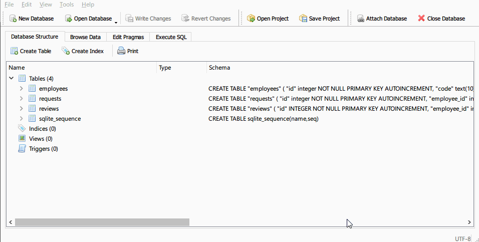

### Skill Chatbot #1: Verifikasi pegawai melalui chatbot

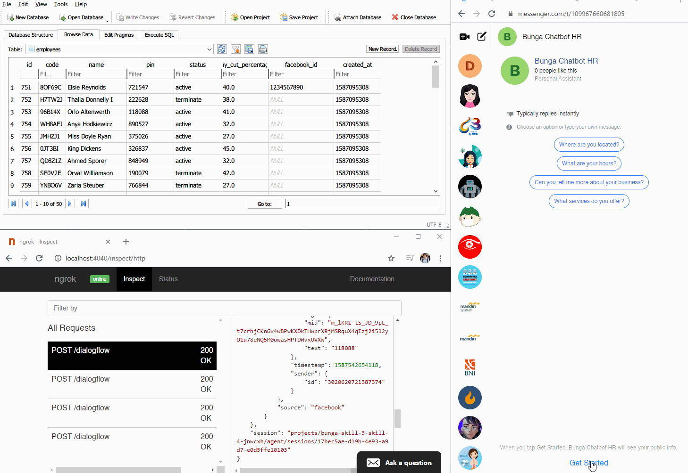

### Skill Chatbot #2: Pengajuan cuti pegawai

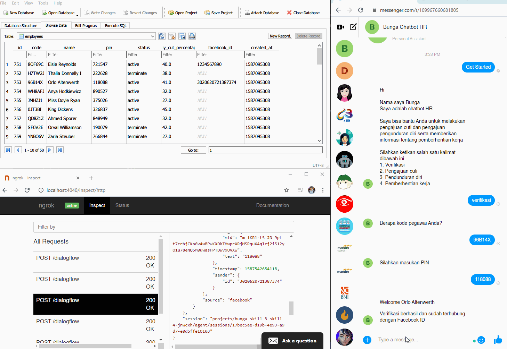

### Skill Chatbot #3.1: Pengajuan pengunduran diri pegawai yang memiliki *performa kerja bagus*

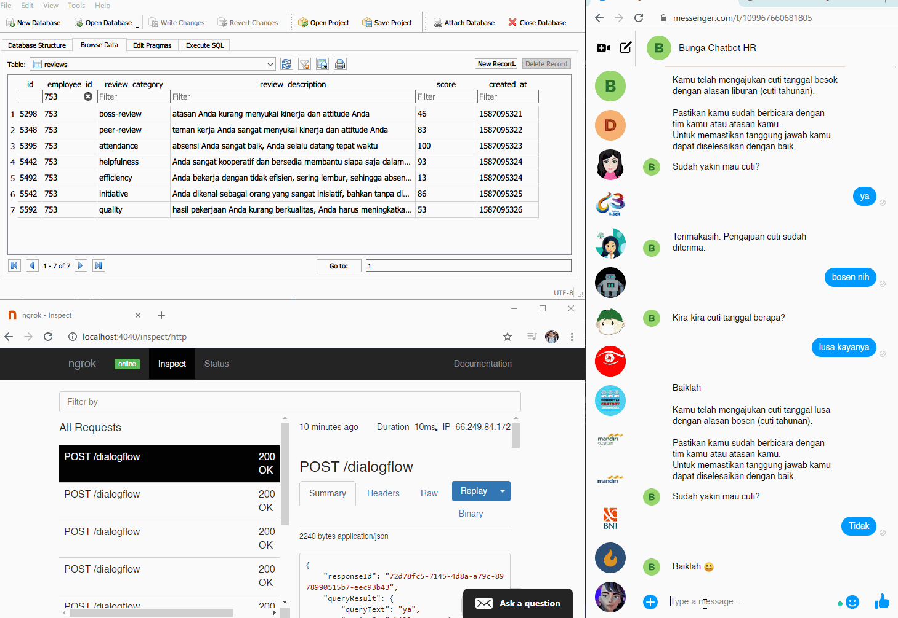

### Skill Chatbot #3.2: Pengajuan pengunduran diri pegawai yang memiliki *performa kerja tidak bagus*

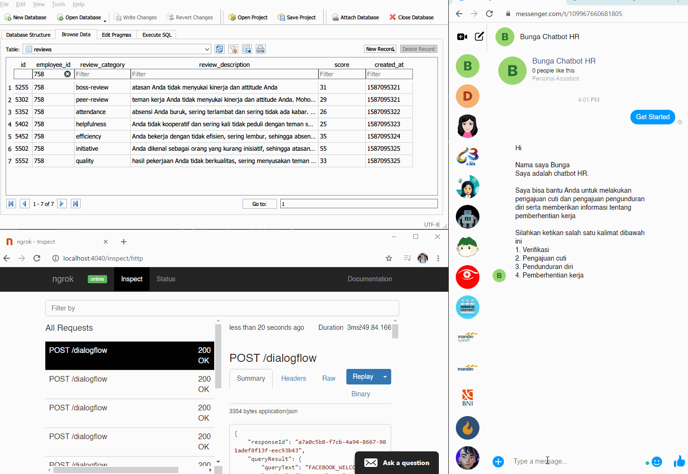

### Skill Chatbot #4: Informasi pemberhentian kerja pegawai dengan status "terminate" melalui Push Message / Direct Message via API Facebook

### Melihat jejak HTTP request dan HTTP response antara Node JS dengan Dialogflow

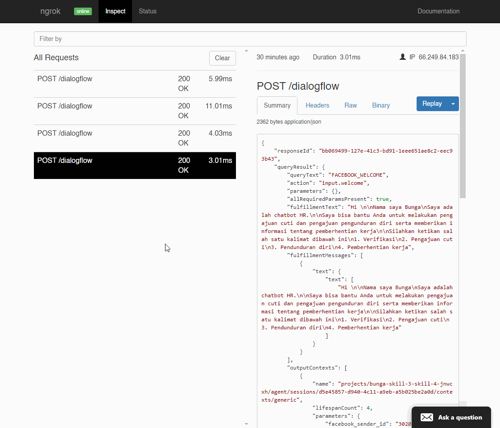

## Persiapan

- Daftar layanan Dialogflow menggunakan akun Google [https://dialogflow.cloud.google.com/#/login](https://dialogflow.cloud.google.com/#/login)
- Daftar sebagai Facebook developer [https://developers.facebook.com/](https://developers.facebook.com/)
- Membuat Apps Facebook untuk integrasi dengan Dialogflow [https://cloud.google.com/dialogflow/docs/integrations/facebook](https://cloud.google.com/dialogflow/docs/integrations/facebook)
- Install Ngrok [https://ngrok.com/download](https://ngrok.com/download)
- Install Code Editor VSCode [https://code.visualstudio.com/download](https://code.visualstudio.com/download) atau gunakan Code Editor apapun yang mendukung JavaScript / NodeJs
- Install Curl / Postman
- Clone repo ini

## Penggunaan

- Jalankan `npm install`
- Nyalakan local server `npm start`
- Nyalakan Ngrok `ngrok http 3000` 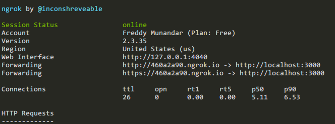
- Buat Agent baru di Dialogflow lalu import file .material/dialogflow-bunga-chatbot-hr.zip 
- 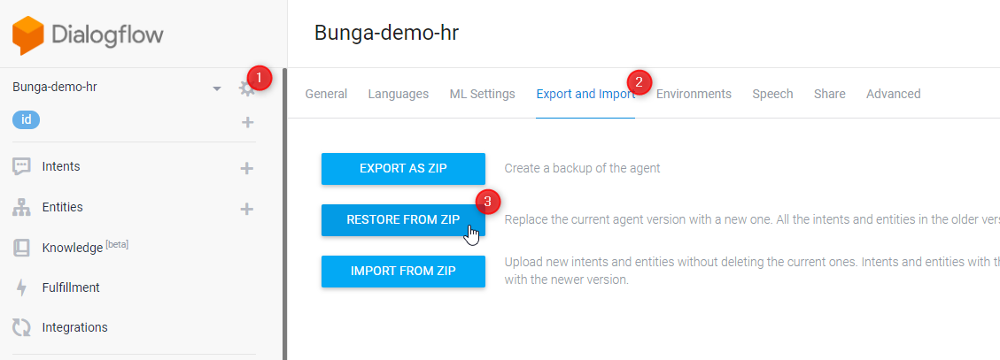
- Aktifkan integrasi dengan Facebook Messenger dan ikutin langkah-langkahnya dilink ini [https://cloud.google.com/dialogflow/docs/integrations/facebook](https://cloud.google.com/dialogflow/docs/integrations/facebook)
- 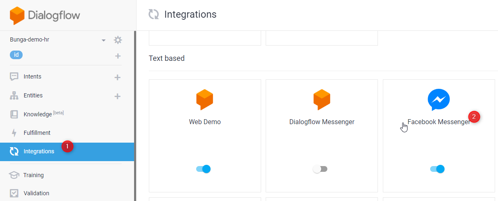
- Pada halaman fulfillment di Dialogflow, arahkan Webhook URL ke `{https_url_dari_ngrok}/dialogflow` lalu tekan tombol 'Save' 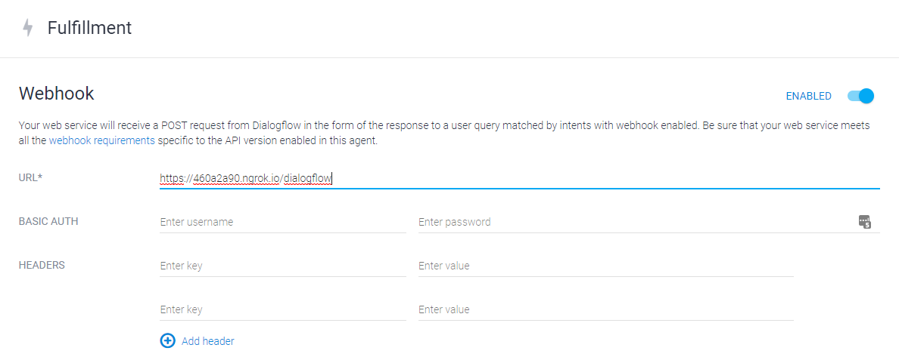
- Buka browser lalu akses halaman [http://localhost:4040](http://localhost:4040) untuk melihat http request dan response yang datang melalui URL yang di *generate* oleh Ngrok
- Untuk setiap intent yang di aktifkan fulfillment nya, maka Dialogflow akan mengirimkan POST http request ke endpoint yang sudah diset di halaman Webhook
- 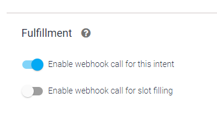
- Buka web Facebook messenger [https://messenger.com](https://messenger.com) untuk menguji integrasi chatbot

## Diskusi Lebih Lanjut

- Grup Telegram Public Chatbot Developer Indonesia [https://t.me/chatbotdev_id](https://t.me/chatbotdev_id)
- Mari ramaikan perkembangan Chatbot di Indonesia
